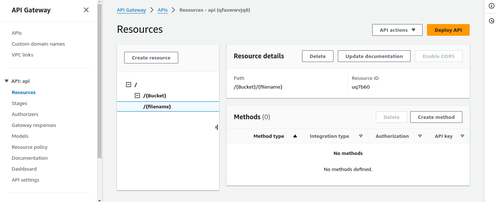

# API Gateway

Now **S3 Bucket** and **IAM Role** Created Now we move forward to Create **API Gateway**

## Creating API

1. Search For <b><u><a href="https://aws.amazon.com/api-gateway/">API Gateway</a></u></b> in console and navigate to the dashboard
2. Then Select **REST API** and Click BUILD
3. On API Details Select **New Api**
4. Enter Api Name and Click **Create API** Button

- The Api Has Been Created now we going to Configure based on File Upload

## Configuring Api

Now We are going to set the API Parameter Format like **/&#123;Bucket&#125;/&#123;filename&#125;**

1. Now Create Bucket name as Parameter inside &#123; &#125; and enter Create Resource
2. below the bucket path Create File name as Parameter same as Bucket name creating and enter Create Resource

- Check the Bucket name and Filename format like mentioned below
  

3. Next create Method for the API. On the Dashboard Right Panel named **Method** Select **Create Method** and Fill the form as same way By Mentioned below

- Method Type :**PUT**
- Integration type: **AWS Service**
- AWS Region : **Sames As S3 Bucket Region**
- AWS service : **S3**
- HTTP method : **PUT**
- Action type : **Use path override**
- Path override - optional :
- Execution role : **Copy Role ARN from the Created AWS IAM Role**
