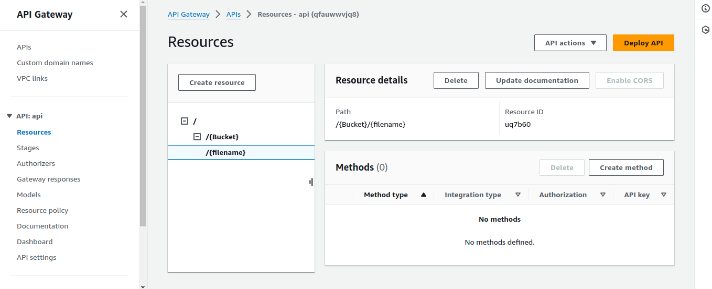

# API Gateway

Now **S3 Bucket** and **IAM Role** Created Now we move forward to Create **API Gateway**

## Creating API

1. Search For <b><u>[API Gateway](https://aws.amazon.com/api-gateway)</u></b> in console and navigate to the dashboard
2. Then Select **REST API** and Click BUILD
3. On API Details Select **New Api**
4. Enter Api Name and Click **Create API** Button

- The Api Has Been Created now we going to Configure based on File Upload

## Configuring Api

Now We are going to set the API Parameter Format like **/&#123;Bucket&#125;/&#123;filename&#125;**

1. Now Create Bucket name as Parameter inside &#123; &#125; and enter Create Resource
2. below the bucket path Create File name as Parameter same as Bucket name creating and enter Create Resource

- Check the Bucket name and Filename format like mentioned below
  
### Create Method
3. Next create Method for the API. On the Dashboard Right Panel named **Method** Select **Create Method** and Fill the form as same way By Mentioned below

- Method Type :**PUT**
- Integration type: **AWS Service**
- AWS Region : **Sames As S3 Bucket Region**
- AWS service : **S3**
- HTTP method : **PUT**
- Action type : **Use path override**
- Path override - optional : **&#123;Bucket&#125;/&#123;Filename&#125;**
- Execution role : **Copy Role ARN from the Created AWS IAM Role**

**And Then the nexr step we need to set the Request From the API, Lets Set**

> In the Right Side from the path Panel appear a Chart look like mentioned below, Click On **Integration Request** > 

Under the chart, Tabs will be appear and click **EDIT** on **Integration request settings**,
The Page will navigate to the Integration Request settings, and Find For **URL path parameters** and there is a form field will open
named as name and Mapped from, just type two datas that like i mentioned below

1. Name: **Bucket** , Mapped From : **method.request.path.Bucket**
2. Name: **filename** , Mapped From : **method.request.path.filename**

then save the form and exit

Open Left Panel and go onto **Api Settings**
Under The **Binary media types (0)** Click **Manage media types** Button and navigate to the Page

> note: if you need to upload image only means just put **image/jpeg** or **image/jpg**

- Otherwies if you upload Any type of files means put **&#x2217;/&#x2217;**

and then click save changes

get Back To Resource Dashboard and Deply the API By Click <button style={{color:"black","backgroundColor": "orange",width:110}}>**Deploy Api**</button> on the Top Right Corner
One last Step is Pending that is

Select Stage Of Your API as **&#x2217;New Stage&#x2217;** and Enter Stage Name then Choose Deploy

Thats All The API Has been Deployed After Some Minutes
> API Is Visible On the Stages Panel named as **Invoke Url**
> And After Dploying, Check The url by upload FIles using Postman or Using **Curl**

 **curl -X POST -H "Content-Type: application/pdf" -d @path/to/your/file.pdf http://localhost:3000/upload-pdf**
